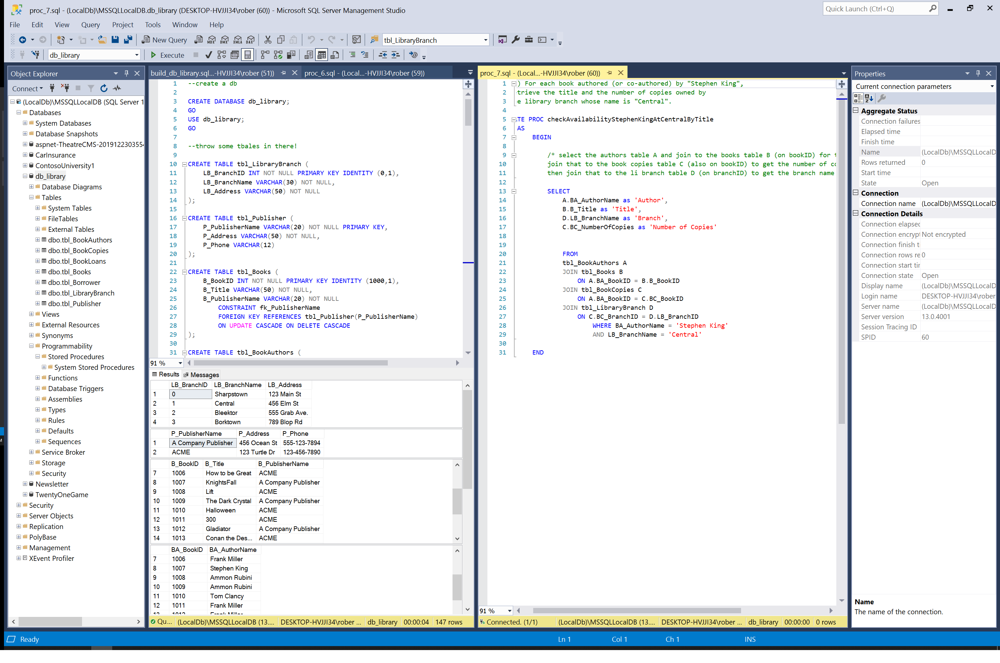

# Library Management System in MS SQL Mangement Studio

This project builds a database for a library managemetn system and fills it with ummy data.



Stored Procedures are used to facilitate common actions that a librarian might find useful.

```sql

--6.) Retrieve the names, addresses, and the number of books checked out 
--for all borrowers who have more than five books checked out.

/* get the card numbers from book loans A that appear more than 5 times
join that to borrowers B (on card numer)
and retrieve names, addresses, and number of books checked out */

CREATE PROC getContactInfoForOverBorrowers
	AS
		BEGIN
			SELECT 
				b.Bo_Name as 'Borrower Name',
				b.Bo_Address as 'Borrower Address',
				COUNT(*) as 'Number of Books Borrowed'
			FROM 
				tbl_BookLoans a 
				JOIN tbl_Borrower b 
			ON 
				a.BL_CardNo = b.Bo_CardNo
			GROUP BY 
				b.Bo_Name, b.Bo_Address
			HAVING 
				COUNT(*) > 5
		END

```
