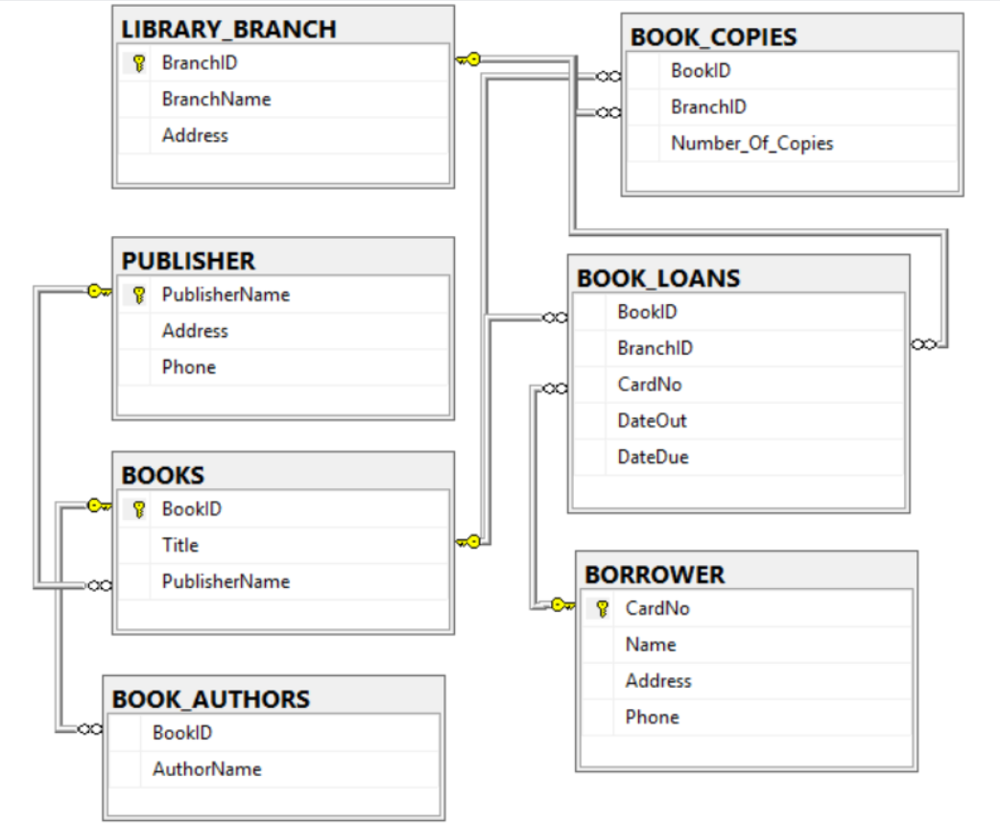

# Library Management System in MS SQL Mangement Studio

This project builds a database for a library, fills it with dummy data and shows off some groovy joins





## Stored Procedures
Stored Procedures are used to facilitate common actions that a librarian might find useful.

### 1.
```sql
CREATE PROC checkNoCopiesOfTheLostTribeAtSharpstown

	AS
		BEGIN

			--1.) How many copies of the book titled "The Lost Tribe" are owned by 
			the library branch whose name is "Sharpstown"?

			DECLARE @bookTitle VARCHAR(50), @branchName VARCHAR(30);
			SET @bookTitle = 'The Lost Tribe';
			SET @branchName = 'Sharpstown'

			SELECT x.LB_BranchName as 'Branch', 
				z.B_Title as 'Title', 
				y.BC_NumberOfCopies FROM tbl_LibraryBranch x
			JOIN tbl_BookCopies y
			ON x.LB_BranchID = y.BC_BranchID
			JOIN tbl_Books z
			ON y.BC_BookID = z.B_BookID
			WHERE z.B_Title = @bookTitle

			SELECT * FROM tbl_LibraryBranch;
			SELECT * FROM tbl_BookCopies;
			SELECT * FROM tbl_Books;

		END

```
### 2. 
```sql
CREATE PROC checkNoCopiesOfBookPerBranch

@bookTitle VARCHAR(50),
@branchName VARCHAR(30)

	AS
		BEGIN
			--2.) How many copies of the book titled "The Lost Tribe"
			--are owned by each library branch? 
			

			SELECT x.LB_BranchName as 'Branch', 
				z.B_Title as 'Title', 
				y.BC_NumberOfCopies FROM tbl_LibraryBranch x
			JOIN tbl_BookCopies y
			ON x.LB_BranchID = y.BC_BranchID
			JOIN tbl_Books z
			ON y.BC_BookID = z.B_BookID
			WHERE z.B_Title = @bookTitle

			SELECT * FROM tbl_LibraryBranch;
			SELECT * FROM tbl_BookCopies;
			SELECT * FROM tbl_Books;
		END
```
### 3.
```sql
CREATE PROC findPeopleWithNoBooksCheckedOut
	AS
		BEGIN

			--3.) Retrieve the names of all borrowers who do not have any books 
			--database has no Book IN/OUT column :/ this will query anyone who has 
			--never checked out a book, which is no one in our database.

			SELECT DISTINCT x.Bo_Name FROM tbl_Borrower x 
				JOIN tbl_BookLoans y 
				ON x.Bo_CardNo = y.BL_CardNo
				WHERE y.BL_DateOut IS NULL

		END


```
### 4.
```sql
CREATE PROC searchSharpstownForDueBooks
	AS
		BEGIN

			DECLARE @todaysDate DATE, @branchName VARCHAR(30);
			SET @todaysDate = getDate();
			SET @branchName = 'Sharpstown';

			/* take the book loans table A and join it to the branch table B (on branch ID) to 
			filter by 'sharpstown'
			join that to the books table C (in book ID) to be able to query the name of the book
			join that to the borrowers table D (on card No) to be able to query the 1. name, 2. 
			address of the borrower */

			SELECT 
				B.LB_BranchName as 'Branch Name',
				C.B_Title as 'Book Title',
				A.BL_DateDue as 'Due Date',
				D.Bo_Name as 'Borrower',
				D.Bo_Address as 'Borrower Address'
					FROM tbl_BookLoans A
						JOIN tbl_LibraryBranch B
							ON A.BL_BranchID = B.LB_BranchID
						JOIN tbl_Books C 
							ON A.BL_BookID = C.B_BookID
						JOIN tbl_Borrower D 
							ON A.BL_CardNo = D.Bo_CardNo

			WHERE B.LB_BranchName = @branchName 
				AND A.BL_DateDue = @todaysDate
			;
		END

```
### 5.
```sql
CREATE PROC getNumberOfBooksLoanedByBranch
	AS
		BEGIN
			SELECT 
			b.LB_BranchName AS 'Branch Name',
			COUNT(1) AS 'Number Of Books Loaned'
				FROM 
					tbl_BookLoans a 
					JOIN tbl_LibraryBranch b 
					ON a.BL_BranchID = b.LB_BranchID
			GROUP BY b.LB_BranchName;
		END

```
### 6.
```sql

--6.) Retrieve the names, addresses, and the number of books checked out 
--for all borrowers who have more than five books checked out.

/* get the card numbers from book loans A that appear more than 5 times
join that to borrowers B (on card numer)
and retrieve names, addresses, and number of books checked out */

CREATE PROC getContactInfoForOverBorrowers
	AS
		BEGIN
			SELECT 
				b.Bo_Name as 'Borrower Name',
				b.Bo_Address as 'Borrower Address',
				COUNT(*) as 'Number of Books Borrowed'
			FROM 
				tbl_BookLoans a 
				JOIN tbl_Borrower b 
			ON 
				a.BL_CardNo = b.Bo_CardNo
			GROUP BY 
				b.Bo_Name, b.Bo_Address
			HAVING 
				COUNT(*) > 5
		END

```
### 7.
```sql
--7.) For each book authored (or co-authored) by "Stephen King", 
--retrieve the title and the number of copies owned by 
--the library branch whose name is "Central".

CREATE PROC checkAvailabilityStephenKingAtCentralByTitle
	AS
		BEGIN

			/* select the authors table A and join to the books table B (on bookID) for titles
			join that to the book copies table C (also on bookID) to get the number of copies
			then join that to the li branch table D (on branchID) to get the branch name */

			SELECT 
				A.BA_AuthorName as 'Author',
				B.B_Title as 'Title',
				D.LB_BranchName as 'Branch',
				C.BC_NumberOfCopies as 'Number of Copies'


				FROM 
				tbl_BookAuthors A
				JOIN tbl_Books B
					ON A.BA_BookID = B.B_BookID
				JOIN tbl_BookCopies C
					ON A.BA_BookID = C.BC_BookID
				JOIN tbl_LibraryBranch D
					ON C.BC_BranchID = D.LB_BranchID
						WHERE BA_AuthorName = 'Stephen King'
						AND LB_BranchName = 'Central'

		END
```
